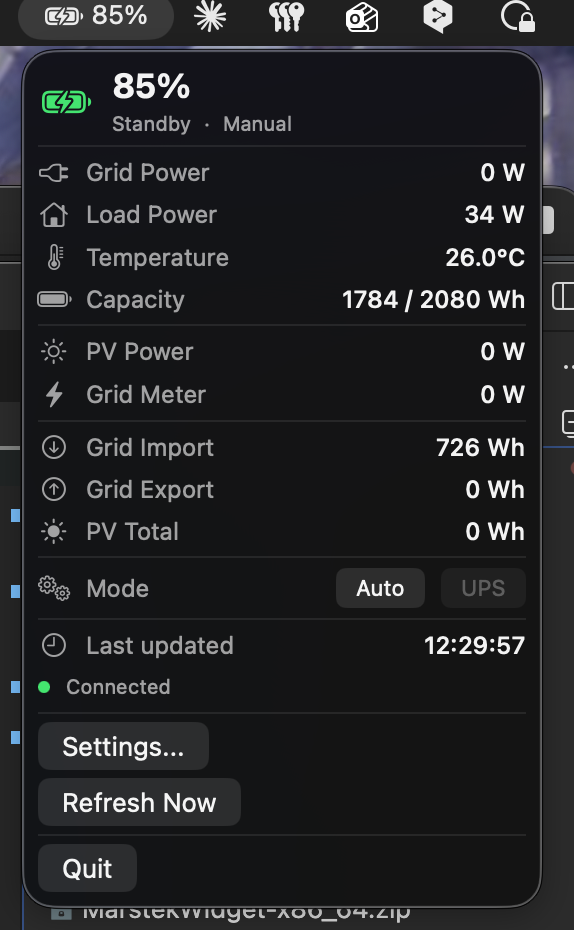

# Marstek Monitor

macOS menu bar widget that shows real-time status of your Marstek home battery (Venus A and compatible models). Battery charge level, solar production, grid import/export — all visible at a glance without opening the Marstek app.



## What it shows

- Battery charge percentage in the menu bar
- Charging / discharging / idle state
- Solar panel (PV) power output
- Grid power — how much you're importing or exporting
- Home load consumption
- Battery temperature and capacity
- Cumulative energy counters (total PV generated, total grid import/export)
- Current operating mode (Auto / Manual) with ability to switch

## Installation

1. Go to [Releases](../../releases/latest) and download the `.zip` file for your Mac:
   - **MarstekWidget-arm64.zip** — for Macs with Apple chip (M1, M2, M3, M4)
   - **MarstekWidget-x86_64.zip** — for Macs with Intel chip
   - Not sure which one? Click Apple menu → "About This Mac". If you see "Apple M…" under Chip — download arm64. Otherwise download x86_64.
2. Unzip the downloaded file — you'll get `MarstekWidget.app`
3. Drag it to the **Applications** folder
4. Double-click to open. macOS will show a warning because the app is not signed. Close the warning, then:
   - Open **System Settings → Privacy & Security**
   - Scroll down — you'll see a message about MarstekWidget being blocked
   - Click **"Open Anyway"**
   - Or: right-click the app in Applications → **Open** → click **Open** in the dialog

You only need to do this once. After that the app will open normally.

## Setup

1. Find your Marstek device IP address. You can usually find it in your router's connected devices list, or in the Marstek mobile app.
2. Launch Marstek Monitor — a battery icon appears in the menu bar (top right of the screen)
3. Click the battery icon → **Settings**
4. Enter the IP address and press Enter
5. Click **Test Connection** to verify the app can reach your device
6. Choose how often you want the data to refresh (30 seconds to 5 minutes)
7. Close the Settings window

The widget will now show your battery status in the menu bar. Click the icon to see the full status panel.

## Requirements

- macOS 14 (Sonoma) or later
- Marstek device must be on the same local network as your Mac
- Device IP address must be reachable (no VPN or network isolation between them)

## How it works

The app communicates directly with your Marstek device over your local network using UDP on port 30000. It sends JSON-RPC requests to query battery status, solar production, grid meter readings, and operating mode. No data is sent to the internet — everything stays on your local network.

## Build from source

Requires Swift 5.9+ and macOS 14+.

```bash
# Build and create .app bundle
make app

# Create distributable .zip (for a single architecture)
make zip

# Build release zips for both Apple Silicon and Intel
make release

# Clean build artifacts
make clean
```
